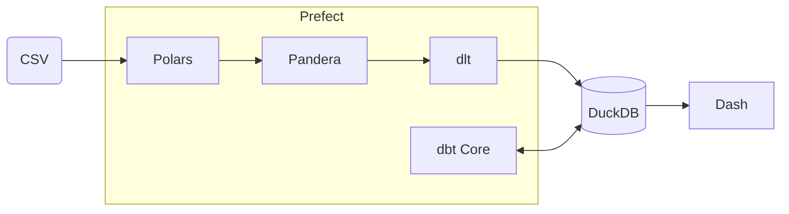

# Mini MDS

[](https://github.com/esadek/mini-mds/actions/workflows/ci.yml)
[](https://www.python.org/downloads/)
[](https://github.com/esadek/mini-mds/blob/main/LICENSE)
[](https://github.com/astral-sh/ruff)

Lightweight, open source, locally-hosted Modern Data Stack

- Extract and Load: [Polars](https://pola.rs/) and [dlt](https://dlthub.com/)
- Data Quality: [Pandera](https://www.union.ai/pandera/)
- Storage: [DuckDB](https://duckdb.org/)
- Transformation: [dbt](https://www.getdbt.com/)
- Orchestration: [Prefect](https://www.prefect.io/)
- Visualization: [Dash](https://dash.plotly.com/)

## Installation

Prerequisites: Install [git](https://git-scm.com/) and [uv](https://docs.astral.sh/uv/).

Clone repository and change directory:

```bash
git clone https://github.com/esadek/mini-mds.git
cd mini-mds
```

## Usage

Extract, validate, load and transform data:

```bash
uv run prefect/elt.py
```

Visualize data:

```bash
uv run dash/app.py
```

## Architecture



## Project Structure

```
mini-mds
├── .github/                # GitHub workflows
├── dash/                   # Dash application
├── dbt/                    # dbt project
├── duckdb/                 # DuckDB warehouse
├── prefect/                # Prefect workflows
├── .editorconfig           # Editor configuration
├── .gitignore              # Untracked files to ignore
├── .python-version         # Default Python version
├── LICENSE                 # MIT license
├── pyproject.toml          # Project metadata
├── README.md               # Documentation
└── uv.lock                 # Dependency lockfile
```
